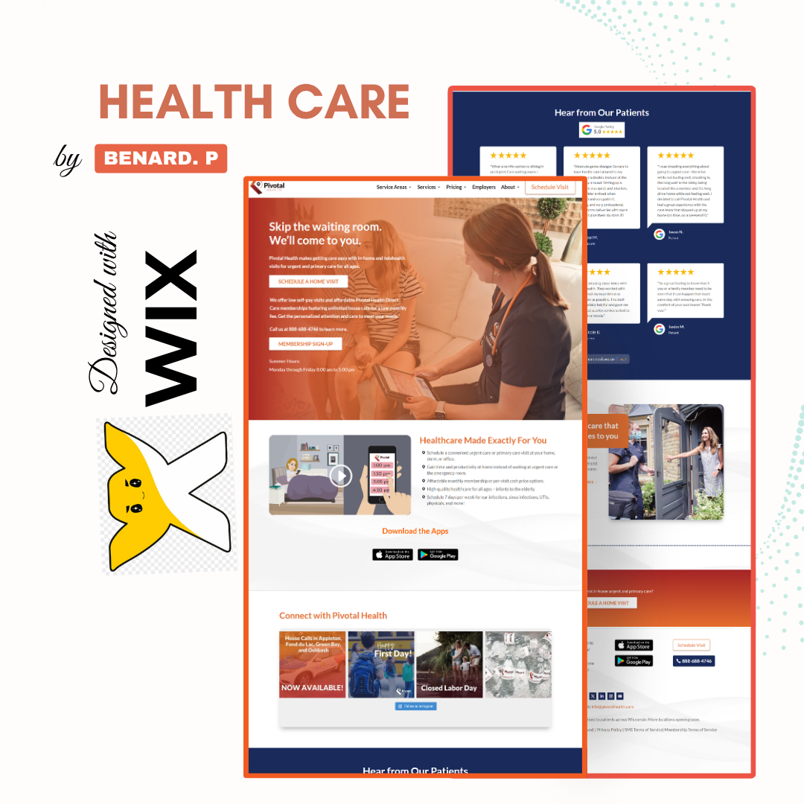

# Wix Healthcare Website Design

## Project Overview

A professional healthcare website designed in Wix with a clean, modern, and trustworthy user experience.

The website was structured to help visitors quickly understand the healthcare services offered, explore important information, and take action through clear calls-to-action.

## Key Features

- Modern healthcare-focused design
- Fully responsive desktop and mobile layout
- Healthcare services sections
- Clear calls-to-action
- Contact and appointment sections
- Easy-to-navigate page structure
- SEO-friendly website structure
- Professional typography and visual hierarchy

## Design Focus

The design focuses on creating a trustworthy and welcoming experience while keeping the information easy for patients and visitors to find.

## Tools & Skills

- Wix
- Wix Studio
- Responsive Web Design
- Website Customization
- Landing Page Design
- SEO

## My Role

**Wix Website Designer**

I handled the website structure, visual design, responsive layout, section organization, and overall user experience.

## Project Type

Healthcare Website Design / Wix Website Design

## Project Preview

### Project Preview

### Website Demo

[Watch the Healthcare Website Demo](healthcare-website-demo.mp4)
